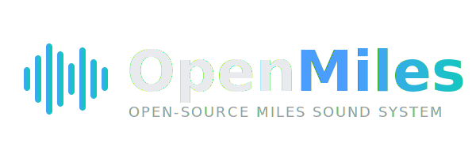
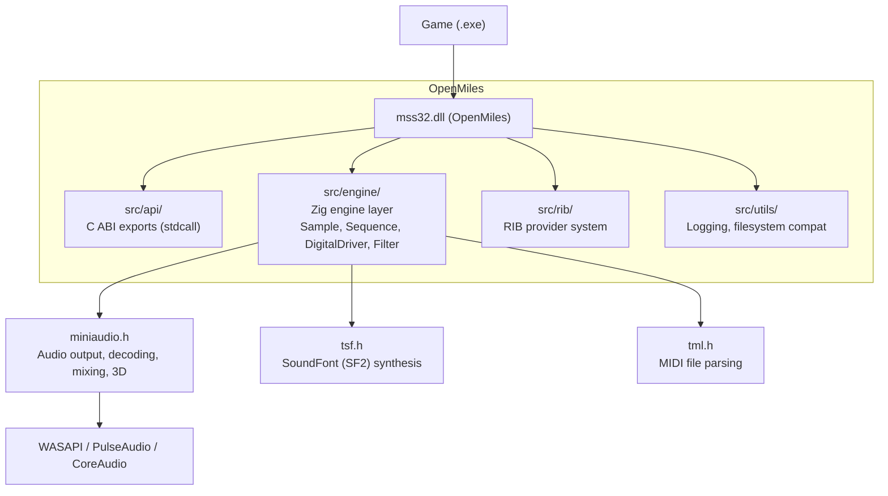

<p align="center">
  
</p>

<p align="center">
  <strong>Open-source drop-in replacement for the Miles Sound System (MSS) DLL</strong>
</p>

<p align="center">
  <a href="https://github.com/maci0/openmiles/actions"></a>
  <a href="LICENSE"></a>
  <a href="https://ziglang.org"></a>
</p>

---

OpenMiles is a clean-room reimplementation of the **Miles Sound System (MSS) 6.6** API in [Zig](https://ziglang.org/), designed as a drop-in `mss32.dll` replacement for legacy Windows games running on modern systems and under [Wine](https://www.winehq.org/).

It replaces the proprietary MSS audio stack with [miniaudio](https://miniaud.io/) for audio output, [TinySoundFont](https://github.com/schellingb/TinySoundFont) for MIDI synthesis, and native decoders for MP3, OGG, WAV, and FLAC -- no proprietary codec plugins required.

## Features

- **Drop-in binary compatible** -- exports the same stdcall ABI as `mss32.dll`
- **Digital audio** -- sample playback, streaming, volume/pan/pitch/loop control
- **MIDI/XMIDI** -- real-time synthesis via SF2 soundfonts, tempo control, beat callbacks, XMIDI loop/branch support
- **3D positional audio** -- full spatial audio with distance attenuation, Doppler, cones, obstruction/occlusion
- **ASI codec system** -- built-in MP3/OGG/WAV/FLAC decoding; also loads external `.asi` plugins as fallback
- **RIB provider system** -- full provider enumeration and interface registration
- **Filter API** -- real-time low-pass filtering via miniaudio DSP nodes
- **Reverb** -- per-sample delay-based reverb
- **Timer API** -- background timer threads with configurable frequency
- **Quick API** -- high-level one-call playback
- **Perceptual volume curve** -- cubic attenuation matching the original MSS ~60dB dynamic range

## Building

Requires [Zig 0.15.2](https://ziglang.org/download/).

```bash
# Native build (Linux/Windows -- for tests)
zig build
zig build test

# Cross-compile for Windows (game deployment)
zig build -Dtarget=x86-windows -Doptimize=ReleaseSmall
```

> **Note:** Native builds on macOS aarch64 (Apple Silicon) are not supported because Zig's stage2 backend does not implement the `aarch64_aapcs_win` calling convention used by the stdcall exports. Use Linux or Windows for native builds, or cross-compile to `x86-windows`.

The output DLL is at `zig-out/bin/mss32.dll`.

## Usage

1. Build the Windows DLL with `zig build -Dtarget=x86-windows -Doptimize=ReleaseSmall`
2. Back up the original `mss32.dll` / `MSS32.DLL` in your game directory
3. Copy `zig-out/bin/mss32.dll` to the game directory (as both `mss32.dll` and `MSS32.DLL` on case-sensitive filesystems)
4. Run the game (natively on Windows, or via Wine on Linux/macOS)

### Debug logging

Set `OPENMILES_DEBUG=1` in your environment to enable verbose logging to `openmiles.log` in the game directory.

```bash
OPENMILES_DEBUG=1 wine YourGame.exe
```

## Architecture



## API Coverage

367 functions exported, covering the full MSS 6.6 API surface (including `DIG_`/`MDI_` aliases and legacy `waveOut`/`midiOut` compatibility). See [docs/API_STATUS.md](docs/API_STATUS.md) for the per-function implementation matrix.

| Category | Status |
|----------|--------|
| Core System | Fully implemented |
| Digital Audio (Samples & Streams) | Fully implemented |
| MIDI / XMIDI | Fully implemented |
| 3D Positional Audio | Fully implemented |
| RIB / ASI Plugin System | Fully implemented |
| Filter API | Low-pass filter implemented |
| Timer API | Fully implemented |
| Quick API | Fully implemented |
| Redbook (CD) API | Stubbed (not applicable) |

## Tested Games

| Game | Status |
|------|--------|
| Europa 1400: The Guild (Gold Edition) | Working -- MP3 streaming, WAV SFX, multiple drivers |

## Documentation

- [API Implementation Status](docs/API_STATUS.md) -- per-function status matrix
- [API Support Matrix](docs/MSS_API_MATRIX.md) -- version compatibility overview
- [Plugin & Codec Coverage](docs/MSS_PLUGINS.md) -- ASI/M3D/FLT replacement status
- [MSS Version History](docs/MSS_VERSION_HISTORY.md) -- historical MSS releases

## Dependencies

All dependencies are vendored single-header C libraries in `deps/`:

| Library | Version | License | Purpose |
|---------|---------|---------|---------|
| [miniaudio](https://github.com/mackron/miniaudio) | v0.11.25 | MIT-0 / Public Domain | Audio output, decoding, mixing, 3D |
| [TinySoundFont](https://github.com/schellingb/TinySoundFont) | v0.9 | MIT | SF2 synthesis |
| [TinyMidiLoader](https://github.com/schellingb/TinySoundFont) | v0.7 | Zlib | MIDI parsing |

## License

This project is licensed under the [GNU General Public License v3.0](LICENSE).

OpenMiles is a clean-room reimplementation. It does not contain any code from the original Miles Sound System by RAD Game Tools.
