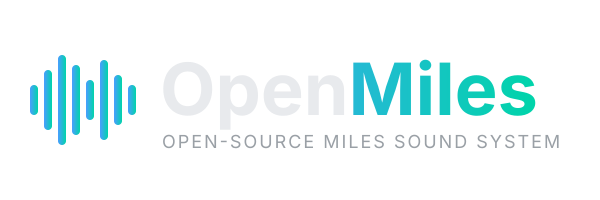
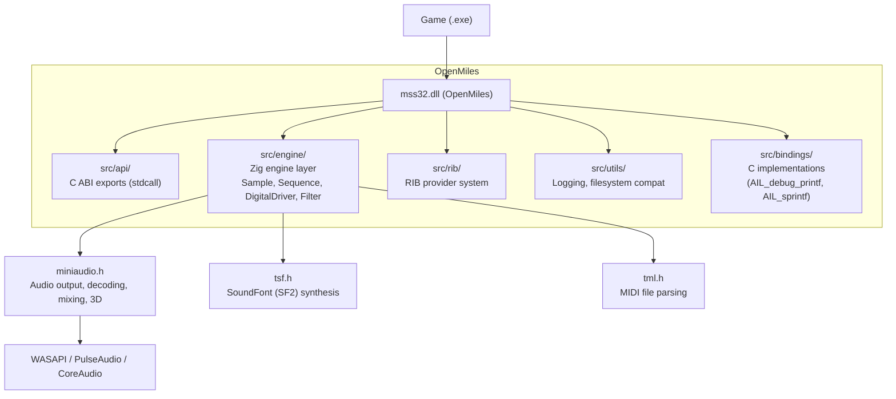

<p align="center">
  
</p>

<p align="center">
  <strong>Open-source drop-in replacement for the Miles Sound System (MSS) DLL</strong>
</p>

<p align="center">
  <a href="https://github.com/maci0/openmiles/actions"></a>
  <a href="LICENSE"></a>
  <a href="https://ziglang.org"></a>
</p>

---

OpenMiles is a clean-room reimplementation of the **Miles Sound System (MSS)** in [Zig](https://ziglang.org/), designed as a drop-in `mss32.dll` replacement for legacy Windows games running on modern systems and under [Wine](https://www.winehq.org/).

One `-Dmss-version` flag selects which historical MSS release the export table mimics. Every selectable version (**v3 through v9**) reproduces its reference `mss32.dll`'s decorated stdcall export table with **zero missing exports** — verified by diffing against the real DLLs with `winedump`.

It replaces the proprietary MSS audio stack with [miniaudio](https://miniaud.io/) for audio output, [TinySoundFont](https://github.com/schellingb/TinySoundFont) for MIDI synthesis, and native decoders for MP3, OGG, and WAV (replacing MSS's proprietary ASI plugins), plus FLAC as a bonus format not in the original MSS.

## Features

- **Drop-in binary compatible** -- exports the same stdcall ABI as `mss32.dll`
- **Digital audio** -- sample playback, streaming, volume/pan/pitch/loop control
- **MIDI/XMIDI** -- real-time synthesis via SF2 soundfonts, tempo control, beat callbacks, XMIDI loop/branch support
- **3D positional audio** -- full spatial audio with distance attenuation, Doppler, cones, obstruction/occlusion
- **ASI codec system** -- built-in MP3/OGG/WAV/FLAC decoding; also loads external `.asi` plugins as fallback
- **RIB provider system** -- full provider enumeration and interface registration
- **Filter API** -- real-time low-pass filtering via miniaudio DSP nodes
- **Reverb** -- per-sample delay-based reverb
- **Timer API** -- background timer threads with configurable frequency
- **Quick API** -- high-level one-call playback
- **Event system (v8/v9)** -- byte-faithful event-text codec (`AIL_create_event` / `AIL_next_event_step`, all step types) plus the v9 `Miles*` API: variables, event enqueue, and a sound-instance lifecycle (durations, label filtering, per-label caps, state reporting)
- **SoundBank (v8/v9)** -- loads the `BANK`-format soundbank into a global container, enumerates event/sound/preset/environment assets, resolves event bytecode + sound info/duration by name
- **Perceptual volume curve** -- cubic attenuation matching the original MSS ~60dB dynamic range
- **Full export-ABI parity** -- v3–v9 export tables diff to zero against the reference DLLs; every exported function is fuzzed and unit-tested

## Building

Requires [Zig 0.16.0](https://ziglang.org/download/).

```bash
# Native build (Linux/Windows -- for tests)
zig build
zig build test

# Cross-compile for Windows (game deployment)
zig build -Dtarget=x86-windows -Doptimize=ReleaseSmall

# Target a specific MSS version's API surface (ABI-shape the export table)
zig build -Dtarget=x86-windows -Doptimize=ReleaseSmall -Dmss-version=5
```

### Targeting an MSS version

`-Dmss-version=<3|4|5|6|6.0|6.1|6.5|6.6|7|8|9>` (default `9`) selects which Miles
release the export table mimics. Each value reproduces that version's reference
`mss32.dll` export table with **zero missing decorated exports** — including the
per-version ABI quirks (functions whose stdcall arity changed across releases,
e.g. `init_sample` `@4→@12→@8`, the v4/v5 5-arg 3D-distance variants, the v7-only
DSP-stage API, and the v8 vs v9 `Miles*` event-API arities).

| Version | Adds | Exports | Parity vs ref |
|---------|------|---------|---------------|
| 3 | Core, Digital, Sample, Streaming, MIDI, Redbook, Timer | 251 | 0 missing (vs 3.6f) |
| 4 | RIB/ASI plugin system + ASI compression, Quick, Input, Memory | 347 | 0 missing (vs 4.0h) |
| 5 | 3D audio, filters | 375 | 0 missing (vs 5.0r) |
| 6 | Filter API maturity | 375 | 0 missing (vs 6.0i) |
| 7 | Unified 2D/3D sample API, master/speaker reverb, DSP stages | 447 | 0 missing (vs 7.0b) |
| 8 | Event system, soundbanks, channel levels, in-memory I/O | 542 | 0 missing (vs 8.0b) |
| 9 | `Miles*` event/variable API, environment presets, 64-bit counters | 641 | 0 missing (vs 9.3f) |

Each build is a *superset* of its reference: it exports every name the real DLL
does (0 missing) plus a small set of harmless cross-era extras. The export count
exceeds the reference count for that reason; the faithfulness metric is the
zero-missing diff.

The v7 unified audio API runs on the engine (3D on the normal `HSAMPLE`,
master/sample reverb, low-pass). The v8/v9 **event system** is byte-faithful
(text constructor + decoder for every step type), the **soundbank** loader reads
real `BANK` files into a global container, and the **event execution VM** parses
enqueued events into tracked sound instances with a full PENDING→PLAYING→COMPLETE
lifecycle (durations resolved from the bank, label-query filtering, per-label
concurrent caps, event-length, cache/persist accounting). The remaining gap is
routing those instances through the miniaudio mixer for actual audio output
(blocked on the bank's embedded-audio data format) — until then event-driven
sounds are tracked and queryable but silent.

The `.asi` plugin ABI (`RIB_INTERFACE_ENTRY` layout + ASI/RIB callback
signatures) is stable across MSS v4–v9, so a plugin built for any v4+ release
loads into any v4+ build; the loader is absent only from a v3 build.

> **Note:** Native builds on macOS aarch64 (Apple Silicon) are not supported because Zig's stage2 backend does not implement the `aarch64_aapcs_win` calling convention used by the stdcall exports. Use Linux or Windows for native builds, or cross-compile to `x86-windows`.

The output DLL is at `zig-out/bin/mss32.dll`.

## Usage

1. Build the Windows DLL with `zig build -Dtarget=x86-windows -Doptimize=ReleaseSmall`
2. Back up the original `mss32.dll` / `MSS32.DLL` in your game directory
3. Copy `zig-out/bin/mss32.dll` to the game directory (as both `mss32.dll` and `MSS32.DLL` on case-sensitive filesystems)
4. Run the game (natively on Windows, or via Wine on Linux/macOS)

### Debug logging

Set `OPENMILES_DEBUG=1` in your environment to enable verbose logging to `openmiles.log` in the game directory.

```bash
OPENMILES_DEBUG=1 wine YourGame.exe
```

## Architecture


```mermaid
graph TD
    Game["Game (.exe)"] --> DLL["mss32.dll (OpenMiles)"]

    subgraph OpenMiles
        DLL --> API["src/api/<br/>C ABI exports (stdcall)"]
        DLL --> Engine["src/engine/<br/>Zig engine layer<br/>Sample, Sequence, DigitalDriver, Filter"]
        DLL --> RIB["src/rib/<br/>RIB provider system"]
        DLL --> Utils["src/utils/<br/>Logging, filesystem compat"]
        DLL --> Bindings["src/bindings/<br/>C implementations<br/>(AIL_debug_printf, AIL_sprintf)"]
    end

    Engine --> MA["miniaudio.h<br/>Audio output, decoding, mixing, 3D"]
    Engine --> TSF["tsf.h<br/>SoundFont (SF2) synthesis"]
    Engine --> TML["tml.h<br/>MIDI file parsing"]

    MA --> Backend["WASAPI / PulseAudio / CoreAudio"]
```

## API Coverage

The default (v9) DLL exports **641** functions spanning the v3–v9 API surface
(legacy `waveOut`/`midiOut` compatibility included; `DIG_`/`MDI_` prefix aliases
not yet exported). Every one of the ~686 distinct exported functions is covered
by the fuzz harness and by unit or C-integration tests. See
[docs/API_STATUS.md](docs/API_STATUS.md) for the per-function implementation matrix.

Beyond export-table parity, behaviour is cross-checked against the MSS SDK
source: getter round-trips, null/error return sentinels, init defaults, and the
sample/stream lifecycle state machines are verified function-by-function against
`wavefile.cpp`/`m3d.cpp`/`mssstrm.cpp` (see the *Behavioural fidelity audit*
section of [docs/API_STATUS.md](docs/API_STATUS.md)).

| Category | Status |
|----------|--------|
| Core System | Mostly implemented (some Windows/hardware-specific APIs are no-ops) |
| Digital Audio (Samples & Streams) | Fully implemented |
| MIDI / XMIDI | Core playback fully implemented; DLS/SF2 loaded via TinySoundFont |
| 3D Positional Audio | Fully implemented |
| RIB / ASI Plugin System | Fully implemented |
| Filter API | Low-pass filter implemented |
| Timer API | Fully implemented |
| Quick API | Fully implemented |
| Event System (v8/v9) | Byte-faithful text codec; execution VM tracks sound instances (lifecycle, durations, label filtering/caps, state counts) — audio output not yet wired |
| SoundBank (v8/v9) | `BANK` loader + global container: asset enumeration, event-bytecode + sound-info/duration lookup |
| Redbook (CD) API | Emulated (no audio -- games proceed gracefully) |

## Tested Games

| Game | Status |
|------|--------|
| Europa 1400: The Guild (Gold Edition) | Working -- MP3 streaming, WAV SFX, multiple drivers |

## Documentation

- [API Implementation Status](docs/API_STATUS.md) -- per-function status matrix
- [API Support Matrix](docs/MSS_API_MATRIX.md) -- version compatibility overview
- [Plugin & Codec Coverage](docs/MSS_PLUGINS.md) -- ASI/M3D/FLT replacement status
- [MSS Version History](docs/MSS_VERSION_HISTORY.md) -- historical MSS releases

## Dependencies

All dependencies are vendored single-header C libraries in `deps/`:

| Library | Version | License | Purpose |
|---------|---------|---------|---------|
| [miniaudio](https://github.com/mackron/miniaudio) | v0.11.25 | MIT-0 / Public Domain | Audio output, decoding, mixing, 3D |
| [TinySoundFont](https://github.com/schellingb/TinySoundFont) | v0.9 | MIT | SF2 synthesis |
| [TinyMidiLoader](https://github.com/schellingb/TinySoundFont) | v0.7 | Zlib | MIDI parsing |

## License

This project is licensed under the [GNU General Public License v3.0](LICENSE).

OpenMiles is a clean-room reimplementation. It does not contain any code from the original Miles Sound System by RAD Game Tools.
