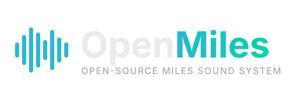
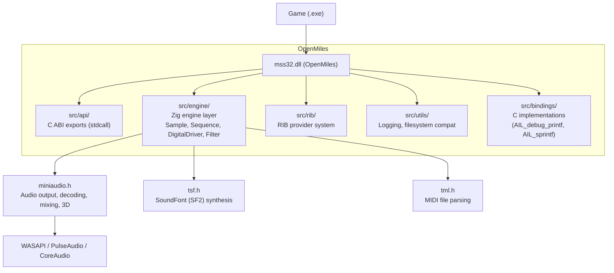

<p align="center">
  
</p>

<p align="center">
  <strong>Open-source drop-in replacement for the Miles Sound System (MSS) DLL</strong>
</p>

<p align="center">
  <a href="https://github.com/maci0/openmiles/actions"></a>
  <a href="LICENSE"></a>
  <a href="https://ziglang.org"></a>
</p>

---

OpenMiles is a clean-room reimplementation of the **Miles Sound System (MSS)** in [Zig](https://ziglang.org/), designed as a drop-in `mss32.dll` replacement for legacy Windows games running on modern systems and under [Wine](https://www.winehq.org/).

One `-Dmss-version` flag selects which historical MSS release the export table mimics. Every selectable version (**v3 through v9**) reproduces its reference `mss32.dll`'s decorated stdcall export table with **zero missing exports** — verified by diffing against the real DLLs with `winedump`.

It replaces the proprietary MSS audio stack with [miniaudio](https://miniaud.io/) for audio output, [TinySoundFont](https://github.com/schellingb/TinySoundFont) for MIDI synthesis, and native decoders for MP3, OGG, and WAV (replacing MSS's proprietary ASI plugins), plus FLAC as a bonus format not in the original MSS.

## Features

- **Drop-in binary compatible** -- exports the same stdcall ABI as `mss32.dll`
- **Digital audio** -- sample playback, streaming, volume/pan/pitch/loop control
- **MIDI/XMIDI** -- real-time synthesis via SF2 soundfonts, tempo control, beat callbacks, XMIDI loop/branch support
- **3D positional audio** -- full spatial audio with distance attenuation, Doppler, cones, obstruction/occlusion
- **ASI codec system** -- built-in MP3/OGG/WAV/FLAC decoding; also loads external `.asi` plugins as fallback
- **RIB provider system** -- full provider enumeration and interface registration
- **Filter API** -- real-time low-pass filtering via miniaudio DSP nodes
- **Reverb** -- per-sample delay-based reverb
- **Timer API** -- background timer threads with configurable frequency
- **Quick API** -- high-level one-call playback
- **Event system (v8/v9)** -- byte-faithful event-text codec (`AIL_create_event` / `AIL_next_event_step`, all step types) plus the v9 `Miles*` API: variables, event enqueue, and a sound-instance lifecycle (durations, label filtering, per-label caps, state reporting)
- **SoundBank (v8/v9)** -- loads the `BANK`-format soundbank into a global container, enumerates event/sound/preset/environment assets, resolves event bytecode + sound info/duration by name
- **Perceptual volume curve** -- cubic attenuation matching the original MSS ~60dB dynamic range
- **Full export-ABI parity** -- v3–v9 export tables diff to zero against the reference DLLs; every exported function is fuzzed and unit-tested

## Building

Requires [Zig 0.16.0](https://ziglang.org/download/). The version is declared
once, as `.minimum_zig_version` in `build.zig.zon`; the Makefile, CI, and the
release workflow all read it from there. `make build` and `make test` run a
version check first and refuse to build on any other Zig; the raw `zig build`
commands below do not.

```bash
# Native build (Linux/Windows -- for tests)
zig build
zig build test

# Cross-compile for Windows (game deployment)
zig build -Dtarget=x86-windows -Doptimize=ReleaseFast

# Target a specific MSS version's API surface (ABI-shape the export table)
zig build -Dtarget=x86-windows -Doptimize=ReleaseFast -Dmss-version=5
```

`make` wraps the same commands: `make help` lists the targets, `make test`,
`make lint`, and `make parity` runs the per-version export-table sweep
(`scripts/check_all_versions.sh`, which needs the reference DLLs under
`references/`, not checked in).

`make check` runs every check CI runs, in CI's order: `make lint`, `make build`,
`make test`, and the Windows cross-compile. Run it before pushing.

`make lint` needs `shellcheck`, a Python 3 interpreter (the gates run under
`python3`, or `python` where that is the name on PATH),
[ruff](https://docs.astral.sh/ruff/) 0.16.4 and
[yamllint](https://github.com/adrienverge/yamllint) 1.38.0 (the pinned
versions, checked before they run) besides Zig, since the `scripts/` gate and
the workflows are linted too; `make lint` names any of the four that is
missing, and CI installs them through the runner image. It checks `zig fmt`,
shellchecks `scripts/*.sh`, lints `.github/workflows`, and asserts that every
declaration in `src/mss.h` agrees with the export table for each
`-Dmss-version` (return type, argument count, calling convention, version
range, struct layout). `src/mss.h` is a documented core subset, so symbols it
does not declare are reported as a coverage count, not a failure; the per-symbol
status for the rest is in [docs/API_STATUS.md](docs/API_STATUS.md).

Every gate under `scripts/` follows one contract: `-h`/`--help` prints its own
usage, the findings and the summary go to stdout as the result of the check, a
missing tool or an unreadable file goes to stderr as the error that stopped it,
and it exits 0 for a pass, 1 for a check failure, 2 for a bad invocation.
`make help` lists each one and what it asserts.

### Running a subset of the tests

The full suite takes a couple of minutes. To run one test, filter by a
substring of its name:

```bash
make test FILTER=redbook           # or: zig build test -Dtest-filter=redbook
```

A `FILTER` that matches no test name is a typo, so `make test` refuses it and
names the problem; the raw `zig build test -Dtest-filter=...` reports a
zero-test run as success.

A test run is quiet: the test build does not enable the debug log by default
(a Debug library build does), so a run neither floods the terminal nor appends
to `openmiles.log`. Set `OPENMILES_DEBUG=1` for a run that wants the engine
trace and the log file.

Contributing setup, the edit-test loop, and what a change is expected to carry
are in [CONTRIBUTING.md](CONTRIBUTING.md).

### Driving time in tests

Every deadline, period, and elapsed counter in the library reads one clock,
`openmiles.clock`. Production reads the platform clock. A test can install a
virtual one instead:

```zig
openmiles.useVirtualClock(0);        // elapsed counters re-base on ns 0
openmiles.clock.advance(ns);          // move simulated time forward
openmiles.sleep(.fromMilliseconds(250)); // advances it instead of blocking
```

`AIL_sleep`, `AIL_delay`, `AIL_ms_count`, and `AIL_us_count` all follow the
installed clock, so a test that sleeps 250 ms spends no wall time and reads
back exactly 250. A `Timer` started under a virtual clock spawns no thread;
call `timer.tick()` once per period you want to elapse, and the callback sees
the exact simulated timestamp. Replaying the same step sequence replays the
same run, which is what makes a failing sequence reproducible.

### Injecting disk faults

Every file the library opens or writes goes through
`openmiles.fs_compat`, which carries an optional fault schedule. A schedule
names the paths it applies to and the fault to produce, so the two faults a
real disk will not produce on demand can be replayed:

```zig
const schedule: openmiles.fs_compat.Fault = .{
    .open = failOpen,          // an open that returns an error
    .truncate_read = shortRead, // a whole-file read that stops short
    .truncate_write = shortWrite, // a whole-file write that stores a prefix
};
openmiles.fs_compat.fault = &schedule; // null in production
```

`open` covers `AIL_file_read`, `Sample.loadFromFile`, soundfont and soundbank
loads, and the plugin directory scans. `truncate_read` covers every whole-file
read: `readWholeFile` refuses the short read, and `AIL_file_read` zero-fills
the tail the read did not reach. `truncate_write` covers the ASI temp image,
which is the only file the library writes; a short write there is discarded
rather than loaded as a module the caller never handed over. Without a
schedule installed, every one of these is a plain whole-file read or write.

### Release archive

`scripts/package_release.sh <out.zip> [sha256sums]` packages
`zig-out/bin/mss32.dll` with the license, this README, the changelog, and the
vendored-dependency attribution (`VENDORED.md`, `DEPS-SHA256SUMS`). It needs
`zip` on PATH and says so if it is missing. `--help` prints the same usage.
The optional second argument writes
a `SHA256SUMS` naming exactly the archive entries, so `sha256sum -c` passes on
an unpacked download. The archive is reproducible: entry order is fixed, every
entry takes one timestamp (`SOURCE_DATE_EPOCH`, defaulting to the HEAD commit
time) pinned to UTC, and no host metadata is stored. Packaging it twice yields
byte-identical files, on any host timezone and locale, which the release
workflow checks with `cmp` after repackaging under a different `TZ` and
`LC_ALL`.

Publishing is a tag push: set `.version` in `build.zig.zon`, push `v<version>`,
and the workflow builds, smoke-tests the DLL, verifies the archive is
reproducible, and creates the GitHub release. The workflow refuses a tag whose
version does not match `build.zig.zon`. A failed run is retried with a manual
dispatch of the same tag from the Actions tab, which republishes over the
existing release without moving the tag.

### Targeting an MSS version

`-Dmss-version=<3|4|5|6|6.0|6.1|6.5|6.6|7|8|9>` (default `9`) selects which Miles
release the export table mimics. `6` and `6.6` are the same build (both encode
66); the other values are distinct. Each value reproduces that version's
reference `mss32.dll` export table with **zero missing decorated exports** —
including the per-version ABI quirks (functions whose stdcall arity changed
across releases, e.g. `init_sample` `@4→@12→@8`, the v4/v5 5-arg 3D-distance
variants, the v7-only DSP-stage API, and the v8 vs v9 `Miles*` event-API
arities).

| Version | Adds | Missing vs ref |
|---------|------|---------------|
| 3 | Core, Digital, Sample, Streaming, MIDI, Redbook, Timer | 0 |
| 4 | RIB/ASI plugin system + ASI compression, Quick, Input, Memory | 0 |
| 5 | 3D audio, filters | 0 |
| 6.1 | Filter API maturity | 0 |
| 6.5 | Low-pass cutoff controls, per-stream level and exclusion calls | 0 |
| 7 | Unified 2D/3D sample API, master/speaker reverb, DSP stages | 0 |
| 8 | Event system, soundbanks, channel levels, in-memory I/O | 0 |
| 9 | `Miles*` event/variable API, environment presets, 64-bit counters | 0 |

`6`/`6.6` (66) and `6.0` (60) have no reference DLL in the sweep: 66 carries the
6.5/6.6 sub-line surface, which neither the 6.1d nor the 6.5h reference covers,
and no 6.0 or 6.6 binary is committed. `src/mss.h` is still checked against the
export table for both, by `scripts/check_header.py`.

`scripts/check_all_versions.sh` reproduces the zero-missing diff per major
version against the reference DLLs listed in that script (3.6a, 4.0h, 5.0b,
6.1d, 6.5h, 7.0k, 8.0e, 9.1d). Those references are proprietary Miles binaries
and are not committed; drop them under `references/` to run the sweep. Its
verdict, not this table, is the parity claim: 0 missing and 0 decoration
mismatch for every version it covers.

Each build is a *superset* of its reference: it exports every name the real DLL
does (0 missing) plus a small set of harmless cross-era extras. The export count
exceeds the reference count for that reason; the faithfulness metric is the
zero-missing diff.

The v7 unified audio API runs on the engine (3D on the normal `HSAMPLE`,
master/sample reverb, low-pass). The v8/v9 **event system** is byte-faithful
(text constructor + decoder for every step type), the **soundbank** loader reads
real `BANK` files into a global container, and the **event execution VM** parses
enqueued events into tracked sound instances with a full PENDING→PLAYING→COMPLETE
lifecycle (durations resolved from the bank, label-query filtering, per-label
concurrent caps, event-length, cache/persist accounting). The remaining gap is
routing those instances through the miniaudio mixer for actual audio output
(blocked on the bank's embedded-audio data format) — until then event-driven
sounds are tracked and queryable but silent.

The `.asi` plugin ABI (`RIB_INTERFACE_ENTRY` layout + ASI/RIB callback
signatures) is stable across MSS v4–v9, so a plugin built for any v4+ release
loads into any v4+ build; the loader is absent only from a v3 build.

> **Note:** Native builds on macOS aarch64 (Apple Silicon) are not supported because Zig's stage2 backend does not implement the `aarch64_aapcs_win` calling convention used by the stdcall exports. Use Linux or Windows for native builds, or cross-compile to `x86-windows`.

The output DLL is at `zig-out/bin/mss32.dll`.

## Usage

1. Build the Windows DLL with `zig build -Dtarget=x86-windows -Doptimize=ReleaseFast`
2. Back up the original `mss32.dll` / `MSS32.DLL` in your game directory
3. Copy `zig-out/bin/mss32.dll` to the game directory (as both `mss32.dll` and `MSS32.DLL` on case-sensitive filesystems)
4. Run the game (natively on Windows, or via Wine on Linux/macOS)

### Linking from your own code

An unmodified game already ships its own `mss.h` and needs none of this. If
you are calling the API from new code, `src/mss.h` declares the core surface.
Set `OPENMILES_MSS_VERSION` to the build you linked (default `90`, the build
`zig build` produces); the header only declares what that build exports, so a
mismatched version fails at compile time instead of at link time.

```c
#define OPENMILES_MSS_VERSION 90
#include "mss.h"

int main(void)
{
    AIL_startup();

    HDIGDRIVER dig = AIL_open_digital_driver(44100, 16, 2, 0);
    if (dig == NULL) {
        /* AIL_last_error() is a stable buffer; it is "" until something fails. */
        const char *err = AIL_last_error();
        (void)err;
        AIL_shutdown();
        return 1;
    }

    /* A real WAV/OGG/MP3 in memory. The one-byte stub below is a placeholder:
       AIL_set_sample_file reads a header out of it, so it always fails, and
       that is the branch a caller has to handle anyway. */
    static const unsigned char image[] = { 0 };
    HSAMPLE S = AIL_allocate_sample_handle(dig);
    if (S != NULL) {
        if (AIL_set_sample_file(S, image, 0) == 0) {
            AIL_start_sample(S);
            while ((AIL_sample_status(S) & SMP_PLAYING) != 0) {
                AIL_serve();
            }
        }
        AIL_release_sample_handle(S);
    }

    AIL_close_digital_driver(dig);
    AIL_shutdown();
    return 0;
}
```

The header covers playback, streaming, MIDI, 3D, RIB, filters, the Quick API,
the v6.5+ unified level/pan/reverb/low-pass and v7+ 3D calls on `HSAMPLE`,
file I/O (`AIL_file_read`, `AIL_file_size`, `AIL_file_type`, and
`AIL_set_file_callbacks` for routing file access through the game's own VFS),
and the `Miles*` event-system and SoundBank API a v8 or v9 build exports
(`MilesStartupEventSystem`, `MilesAddSoundBank`, `MilesEnqueueEvent`,
`MilesEnumerateSoundInstances`, and the rest, with the `MSS_FIRST` walk
convention and the `MILESEVENTSOUNDSTATUS_*` and `MILESEVENT_ENQUEUE_*`
constants). The v7 DSP-stage, the `AIL_add_*_event_step` event-text builders,
the v9 per-bus mixer calls, and the legacy `waveOut`/`midiOut` exports are not
declared; see [docs/API_STATUS.md](docs/API_STATUS.md) for the
full list, and add your own declaration from the export table in
`src/main.zig` if you need one.

`make check-header` re-checks every declaration in `mss.h` against that export
table, and the `AILSOUNDINFO` layout against `src/root.zig`, for all ten distinct
version encodings, and compiles the header once per encoding with the same
warning set `build.zig` compiles C with (`-Wall -Wextra -Werror` plus the
pedantic, shadow, prototype, VLA, format and write-strings groups), so a
declaration that only parses is caught here rather than in your build. It runs
as part of `make lint`.

### Configuration

The library reads its runtime configuration from the process environment. It
reads two variables and has no config file, so the table below is the whole
surface: nothing else in the environment changes its behaviour.

| Variable | Values | Default | Effect |
|----------|--------|---------|--------|
| `OPENMILES_DEBUG` | `1`/`0`, `true`/`false`, `yes`/`no`, `on`/`off`, any case | logging on in a Debug build, off otherwise | Verbose trace to `openmiles.log` in the game directory and to the debugger, capped at 64 MiB |
| `TMPDIR` | an absolute directory path | `%TEMP%` on Windows, the game directory on other systems | Where the in-memory ASI plugin image is unpacked before it is loaded |

An `OPENMILES_DEBUG` value outside that set (including an empty one) is
reported on stderr and leaves the default in place, rather than silently
meaning off. A `TMPDIR` that is empty, too long, or not absolute is reported the
same way and the image is written to the game directory instead.

`-Dmss-version` and `-Doptimize` are build-time options (`zig build --help`),
not runtime configuration: the shipped DLL is the same build everywhere, and
selecting a version requires a rebuild.

#### Debug logging

Set `OPENMILES_DEBUG=1` in your environment to enable verbose logging to `openmiles.log` in the game directory.

```bash
OPENMILES_DEBUG=1 wine YourGame.exe
```

Debug builds enable logging by default; set `OPENMILES_DEBUG=0` to turn it off. Release builds log only when `OPENMILES_DEBUG` names a true value (`1`, `true`, `yes`, or `on`). The on-disk log is capped at 64 MiB per process to prevent unbounded growth.

## Architecture


```mermaid
graph TD
    Game["Game (.exe)"] --> DLL["mss32.dll (OpenMiles)"]

    subgraph OpenMiles
        DLL --> API["src/api/<br/>C ABI exports (stdcall)"]
        DLL --> Engine["src/engine/<br/>Zig engine layer<br/>Sample, Sequence, DigitalDriver, Filter"]
        DLL --> RIB["src/rib/<br/>RIB provider system"]
        DLL --> Utils["src/utils/<br/>Logging, filesystem compat"]
        DLL --> Bindings["src/bindings/<br/>C implementations<br/>(AIL_debug_printf, AIL_sprintf)"]
    end

    Engine --> MA["miniaudio.h<br/>Audio output, decoding, mixing, 3D"]
    Engine --> TSF["tsf.h<br/>SoundFont (SF2) synthesis"]
    Engine --> TML["tml.h<br/>MIDI file parsing"]

    MA --> Backend["WASAPI / PulseAudio / CoreAudio"]
```

## API Coverage

The default (v9) DLL exports **394** functions spanning the v3–v9 API surface
(legacy `waveOut`/`midiOut` compatibility included; `DIG_`/`MDI_` prefix aliases
not yet exported). Every exported function is covered by the fuzz harness and by
unit or C-integration tests. See
[docs/API_STATUS.md](docs/API_STATUS.md) for the per-function implementation matrix.

Beyond export-table parity, behaviour is cross-checked against the MSS SDK
source: getter round-trips, null/error return sentinels, init defaults, and the
sample/stream lifecycle state machines are verified function-by-function against
`wavefile.cpp`/`m3d.cpp`/`mssstrm.cpp` (see the *Behavioural fidelity audit*
section of [docs/API_STATUS.md](docs/API_STATUS.md)).

| Category | Status |
|----------|--------|
| Core System | Mostly implemented (some Windows/hardware-specific APIs are no-ops) |
| Digital Audio (Samples & Streams) | Fully implemented |
| MIDI / XMIDI | Core playback fully implemented; DLS/SF2 loaded via TinySoundFont |
| 3D Positional Audio | Fully implemented |
| RIB / ASI Plugin System | Fully implemented |
| Filter API | Low-pass filter implemented |
| Timer API | Fully implemented |
| Quick API | Fully implemented |
| Event System (v8/v9) | Byte-faithful text codec; execution VM tracks sound instances (lifecycle, durations, label filtering/caps, state counts) — audio output not yet wired |
| SoundBank (v8/v9) | `BANK` loader + global container: asset enumeration, event-bytecode + sound-info/duration lookup |
| Redbook (CD) API | Emulated (no audio -- games proceed gracefully) |

## Tested Games

| Game | Status |
|------|--------|
| Europa 1400: The Guild (Gold Edition) | Working -- MP3 streaming, WAV SFX, multiple drivers |

## Documentation

- [Contributing](CONTRIBUTING.md) -- setup, the edit-test loop, what a change carries
- [Changelog](CHANGELOG.md) -- consumer-facing changes per release
- [API Implementation Status](docs/API_STATUS.md) -- per-function status matrix
- [API Support Matrix](docs/MSS_API_MATRIX.md) -- version compatibility overview
- [Plugin & Codec Coverage](docs/MSS_PLUGINS.md) -- ASI/M3D/FLT replacement status
- [MSS Version History](docs/MSS_VERSION_HISTORY.md) -- historical MSS releases
- [Threat Model](docs/THREAT_MODEL.md) -- attack surface, trust boundaries, risk ranking
- [Security Policy](SECURITY.md) -- reporting a vulnerability

## Dependencies

All dependencies are vendored single-header C libraries in `deps/`:

| Library | Version | License | Purpose |
|---------|---------|---------|---------|
| [miniaudio](https://github.com/mackron/miniaudio) | v0.11.25 | MIT-0 / Public Domain | Audio output, decoding, mixing, 3D |
| [TinySoundFont](https://github.com/schellingb/TinySoundFont) | v0.9 | MIT | SF2 synthesis |
| [TinyMidiLoader](https://github.com/schellingb/TinySoundFont) | v0.7 | Zlib | MIDI parsing |

There is nothing to install and nothing a package manager resolves. The exact
bytes of each vendored file are pinned in [`deps/SHA256SUMS`](deps/SHA256SUMS),
and the upstream commit each was fetched from is recorded in
[`deps/README.md`](deps/README.md); `make check-vendored`, which `make lint` and
CI run, verifies both. See that file for the update procedure.

[`SBOM.cdx.json`](SBOM.cdx.json) is the same inventory as CycloneDX: the
vendored headers above with their licenses and digests, plus the pip pins the
parity sweep needs. It is generated from those same records by
`scripts/gen_sbom.py` and shipped inside the release archive, so a consumer can
tell what third-party code the DLL carries without cloning this repository.
`make check-sbom` fails when it no longer matches the tree.

## License

This project is licensed under the [GNU General Public License v3.0](LICENSE).

OpenMiles is a clean-room reimplementation. It does not contain any code from the original Miles Sound System by RAD Game Tools.
