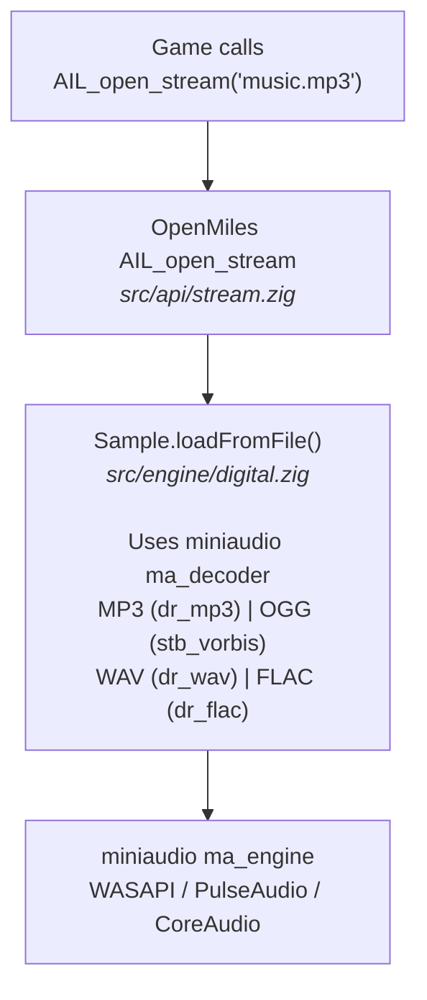

# Miles Sound System (MSS) Standard Plugins & Codecs

Miles Sound System is highly modular, using external providers for 3D audio, DSP filters, and compressed audio decoders. These files are typically found in the application directory or a `redist` folder.

## 1. 3D Audio Providers (`.m3d`)
These plugins implement the 3D spatialization logic. MSS typically ships with software fallbacks and hardware-specific wrappers.

| File | Provider Name | Description |
|------|---------------|-------------|
| `Mssfast.m3d` | Miles Fast 2D | Optimized 2D software mixing with basic panning. |
| `Mss3d.m3d` | Miles 3D Audio | Standard software-based 3D spatialization. |
| `Mssds3d.m3d` | DirectSound3D | Wrapper for Microsoft DirectSound3D hardware acceleration. |
| `Msseax.m3d` | Creative EAX | Support for Environmental Audio Extensions (EAX 1.0 - 4.0). |
| `Mssrsx.m3d` | Intel RSX | Intel Realistic Sound Experience spatializer. |
| `Mssq3d.m3d` | QSound Q3D | QSound's proprietary 3D audio technology. |
| `Mssa3d.m3d` | Aureal A3D | Hardware acceleration for Aureal Vortex sound cards. |
| `Msssens.m3d` | Sensaura 3D | Multi-platform 3D audio technology (common on early AC'97). |
| `Mssdolby.m3d` | Dolby Surround | Encoding logic for matrix-based surround sound. |

## 2. Digital Filter Providers (`.flt`)
Filters are applied to samples or streams via the `AIL_open_filter` API.

| File | Filter Name | Common Use Cases |
|------|-------------|------------------|
| `Msslowp.flt` | Low-pass Filter | Underwater effects, muffled sounds behind walls. |
| `Mssreverb.flt` | Environmental Reverb | Hallways, caves, large open spaces. |
| `Mssdsp.flt` | General DSP | Parametric EQ, pitch shifting, and custom effects. |

## 3. Audio Stream Interface (ASI) Codecs (`.asi`)

ASI providers are decoders for compressed formats. They register with the RIB (RAD Interface Broker) system during `AIL_startup()` and are queried by the game via `RIB_enumerate_providers("ASI stream", ...)` before calling `AIL_open_stream`.

### Complete Known ASI Plugins

| File(s) | Codec | Introduced | Handled Formats | Proprietary? |
|---------|-------|-----------|-----------------|--------------|
| `Mp3dec.asi` | MPEG Layer 3 (early) | MSS 3.x | `.mp3` | Yes |
| `Mssmp3.asi` | MPEG Layer 3 (optimized) | MSS 5.x | `.mp3` | Yes |
| `Mss64mp3.asi` | MPEG Layer 3 (x64) | MSS 6.1+ | `.mp3` | Yes |
| `Mssogg.asi` / `Ogg.asi` | Ogg Vorbis | MSS 6.1+ | `.ogg` | Yes (wrapper) |
| `Mss64ogg.asi` | Ogg Vorbis (x64) | MSS 6.1+ | `.ogg` | Yes (wrapper) |
| `Mssvoice.asi` | Voxware MetaVoice (meta) | MSS 5.x | `.wav` (encoded) | Yes |
| `Mssv12.asi` | Voxware MetaVoice VR12 | MSS 5.x | `.wav` (1200 bps speech) | Yes |
| `Mssv24.asi` | Voxware MetaVoice RT24 | MSS 5.x | `.wav` (2400 bps speech) | Yes |
| `Mssv29.asi` | Voxware MetaVoice RT29 | MSS 5.x | `.wav` (2900 bps speech) | Yes |
| `Binkawin.asi` / `Bink.asi` | Bink Audio | MSS 9.x | `.bink` | Yes (RAD) |
| `Binkawin64.asi` | Bink Audio (x64) | MSS 9.x | `.bink` | Yes (RAD) |
| `Mss32.asi` | Legacy Bridge | MSS 6.x | (compatibility shim) | Yes |

### RIB Interface Registration

Every ASI plugin registers **two** interfaces with the RIB system:

1. **`"ASI codec"`** — Identifies the plugin as an audio codec provider.
2. **`"ASI stream"`** — Identifies streaming/playback capability; this is what games query.

Games use `RIB_enumerate_providers("ASI stream", ...)` to check whether MP3/OGG/etc. streaming is available. If no provider with an `"ASI stream"` interface is found, the game silently skips background music.

### ASI Interface Entry Reference

Each interface is an array of `RIB_INTERFACE_ENTRY` structs. The core entries that every ASI codec must provide:

| Entry Name | Type | Purpose |
|-----------|------|---------|
| `ASI stream open` | `RIB_FUNCTION` | Opens a compressed file and returns an opaque stream handle. Signature: `(file_tag: u32, filename: [*:0]const u8, open_flags: u32) -> ?*ASI_stream` |
| `ASI stream close` | `RIB_FUNCTION` | Closes and frees a stream handle. |
| `ASI stream process` | `RIB_FUNCTION` | Decodes the next chunk of PCM data from the stream into a caller-supplied buffer. Returns bytes written. |
| `ASI stream seek` | `RIB_FUNCTION` | Seeks to a byte position within the decoded PCM output. |
| `ASI stream attribute` | `RIB_FUNCTION` | Queries a named attribute of the stream (e.g. `"OUTPUT RATE"`, `"OUTPUT CHANNELS"`, `"OUTPUT BITS"`). |
| `Input file types` | `RIB_ATTRIBUTE` | Null-separated list of handled extensions, e.g. `".mp3\0"` or `".ogg\0"`. |
| `Output file types` | `RIB_ATTRIBUTE` | Null-separated list of output formats, typically `".raw\0.pcm\0"`. |

Real MSS plugins register additional codec-specific entries (10-23 total per interface), including:

| Entry Name | Type | Notes |
|-----------|------|-------|
| `Minimum input block size` | `RIB_ATTRIBUTE` | Minimum buffer size the codec needs to decode a single frame. |
| `ASI stream property` | `RIB_FUNCTION` | Advanced property get/set (codec-specific). |
| `Name` | `RIB_ATTRIBUTE` | Human-readable codec name (e.g. `"Miles MP3 Decoder"`). |
| `Version` | `RIB_ATTRIBUTE` | Version string. |

OpenMiles registers a **7-entry simplified interface** covering the 5 core functions + 2 file-type attributes. This is sufficient for all games tested to date, since games only call the core 5 functions.

### Stream Attribute Names

When a game calls `ASI stream attribute(stream, name)`, the following attribute names are standard:

| Attribute Name | Returns | Description |
|---------------|---------|-------------|
| `"OUTPUT RATE"` | `i32` | Sample rate of the decoded PCM (e.g. 44100). |
| `"OUTPUT CHANNELS"` | `i32` | Number of channels (1 = mono, 2 = stereo). |
| `"OUTPUT BITS"` | `i32` | Bits per sample (always 16 for MSS). |

## 4. Console Specific Providers (v7.x+)
On consoles like PS2, Xbox, and Wii, providers often managed specific hardware DMA channels.

- **`Mssps2.m3d`**: PS2 SPU2 hardware acceleration.
- **`Mssxbox.m3d`**: Original Xbox MCPX hardware acceleration.

## 5. OpenMiles Built-in Replacement Status

### How It Works

During `AIL_startup()`, OpenMiles registers a **built-in ASI provider** under both `"ASI codec"` and `"ASI stream"` interface names. This provider uses **miniaudio** for decoding instead of external `.asi` DLLs.

When a game queries `RIB_enumerate_providers("ASI stream", ...)`, it finds the built-in provider and proceeds to call `AIL_open_stream`, which decodes natively through miniaudio. No proprietary plugin files are needed for supported formats.

External `.asi` files in the game directory are **also** scanned and loaded as a fallback, so games shipping proprietary codecs that OpenMiles doesn't cover can still use them.

### Coverage Matrix

| Format | Original Plugin | OpenMiles Built-in | Status |
|--------|----------------|-------------------|--------|
| MP3 | `Mp3dec.asi` / `Mssmp3.asi` | miniaudio `ma_decoder` | **Fully replaced** |
| Ogg Vorbis | `Mssogg.asi` / `Ogg.asi` | miniaudio `ma_decoder` | **Fully replaced** |
| WAV / PCM | (native in MSS) | miniaudio `ma_decoder` | **Fully replaced** |
| FLAC | (not in original MSS) | miniaudio `ma_decoder` | **Bonus — exceeds original** |
| Voxware VR12 | `Mssv12.asi` | Not implemented | Falls back to external `.asi` if present |
| Voxware RT24 | `Mssv24.asi` | Not implemented | Falls back to external `.asi` if present |
| Voxware RT29 | `Mssv29.asi` | Not implemented | Falls back to external `.asi` if present |
| Bink Audio | `Binkawin.asi` | Not implemented | Falls back to external `.asi` if present |

### Filter Coverage

| Filter Type | Original Plugin | OpenMiles Built-in | Status |
|-------------|----------------|-------------------|--------|
| Low-pass Filter | `Msslowp.flt` | miniaudio `ma_lpf_node` | **Fully replaced** |
| Environmental Reverb | `Mssreverb.flt` | Not implemented as a `.flt` plugin | Per-sample reverb available via `AIL_set_sample_reverb` (ma_delay_node) |
| General DSP | `Mssdsp.flt` | Not implemented | Falls back to external `.flt` if present |

The built-in low-pass filter supports real-time cutoff frequency (20-22050 Hz) and order (1-4) control via `AIL_set_filter_attribute`. Samples are routed through the filter node via `AIL_set_sample_filter`.

Per-sample reverb (via `AIL_set_sample_reverb`/`AIL_set_stream_reverb`/`AIL_quick_set_reverb`) uses a `ma_delay_node` that maps `room_type`→decay, `level`→wet/dry mix, `reflect_time`→delay frames. This is independent of the Filter API.

### What Would Be Needed for Full Replacement

| Codec | Difficulty | Approach |
|-------|-----------|----------|
| **Voxware MetaVoice** | Hard | Proprietary codec with no open-source implementation. These plugins handle low-bitrate speech (1200-2900 bps). Few games rely on them heavily. The original `.asi` files can be used as a fallback. |
| **Bink Audio** | Medium | RAD Game Tools' proprietary codec. An open-source Bink audio decoder exists in FFmpeg (`libavcodec/binkaudio.c`). Could be integrated via a lightweight decode wrapper. |

### Architecture Diagram

The RIB system (`"ASI stream"` registration) exists purely so the **game's own code** can verify codec support before calling `AIL_open_stream`. The actual decoding path in OpenMiles bypasses RIB entirely and goes straight through miniaudio.
